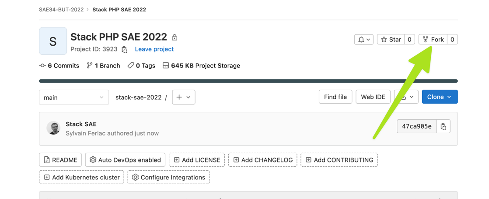

Stack de développement PHP SAE 2022
===================================

Prérequis
---------

Sur votre machine Mac, Windows ou Linux :

- Docker 20.20 au moins
- (Docker) Compose  
  (Installer Docker Desktop satisfait ces deux pré-requis)
- Un éditeur de texte ou un IDE
- L'accès à un terminal

De manière optionnelle, mais fortement recommandée :

- Une [clé SSH](https://forge.iut-larochelle.fr/help/ssh/index#generate-an-ssh-key-pair) active sur votre machine
  (perso) et [ajoutée dans votre compte gitlab](https://forge.iut-larochelle.fr/help/ssh/index#add-an-ssh-key-to-your-gitlab-account) :  
  elle vous permettra de ne pas taper votre mot de passe en permanence.
- PHPStorm  
  _Votre email étudiant vous permet de bénéficier d'une licence complète de 12 mois pour tous les produits JetBrains_  
  ...Mais vous pouvez bien sûr utiliser l'IDE de votre choix.

Démarrage
---------

### 1. Forker le modèle de stack

**UN.E SEUL.E** des développeuses/développeurs de votre équipe va **fork** le présent dépôt, pour en créer un nouveau, 
dans le groupe correspondant à votre équipe :  
_Par exemple pour l'équipe 3 du groupe de TP X1, le groupe est :_ `SAE34-BUT-2022/x1/eq3`

> **Remarque** : il n'est pas nécessaire de conserver le lien avec le modèle de stack, vous pouvez donc aller dans  
> Settings > General > Advanced (dans Gitlab) pour supprimer le "Fork relationship" de votre projet

### 2. Cloner et démarrer la stack

Une fois ce fork réalisé, vous pouvez cloner ce nouveau dépôt sur les postes de travail de chacun des membres de 
l'équipe et démarrer la stack.

> ⚠️ **Si vous êtes sous Linux**  
> Avant de démarrer la stack, il faut renseigner votre l'id et le group_id de votre user dans un fichier `.env` à la racine du dépôt.  
> Copiez le modèle `.env.dist` vers `.env` et remplacez si nécessaire les valeurs d'exemple (1000).  
> _(vous pouvez obtenir l'id de votre user (et de son groupe) en lançant la commande `id -u ${USER}` dans un terminal)_

Démarrer la stack :  
`docker compose up --build -d`

Une fois les conteneurs démarrés, vous pouvez vérifier que php fonctionne :  
`docker exec -it sae-php php -v`

### 3. Initialiser le projet Symfony

Le serveur web est configuré pour qu'un projet symfony soit hébergé dans le répertoire `/symfony`  

Installer Symfony avec :  
`rm -Rf symfony/.gitignore && docker exec -it sae-php /bin/sh -c "/usr/bin/composer create-project symfony/website-skeleton /var/www/html 5.4.* --no-interaction --verbose"`  

> ℹ️ **Précisions**
> - On utilise `website-skeleton` pour avoir une appli web complète.  
> - On utilise un Symfony en version 5.4 pour des soucis de compatibilité avec les enseignements qui seront dispensés au semestre 4.  
> - Le `rm` est là pour être sûr qu'il n'y a rien dans le répertoire symfony avant d'exécuter la commande.  
> - Le chemin `/var/www/html` est le nom du répertoire dans lequel on veut créer notre projet _dans le conteneur_. Il **DOIT** s'appeler `/var/www/html`.

Une fois cette commande exécutée, votre symfony est opérationnel :  
http://localhost:9979 🎉

ℹ️ Pour éviter les ambiguïtés, vous pouvez faire un peu de ménage dans les fichiers du répertoire symfony : 
les fichiers suivants peuvent être supprimés :
- `symfony/docker-compose.yml`
- `symfony/docker-compose.override.yml`

> ⚠️ **Attention** : 
> le .gitignore livré avec Symfony (`symfony/.gitignore`) est prévu pour une installation de Symfony
à la racine du dépôt, ce qui n'est pas notre cas.  
> Prenez le temps de modifier les règles présentes dans ce fichier, **avant de faire votre premier commit** :
- ...
- [- /.env.local -]
- [+ .env.local +]
- [- /.env.local.php -]
- [+ .env.local.php +]
- [- /.env.*.local -]
- [+ .env.*.local +]
- [- /config/secrets/prod/prod.decrypt.private.php -]
- [+ config/secrets/prod/prod.decrypt.private.php +]
- [- /public/bundles/ -]
- [+ public/bundles/ +]
- ...
- [- /var/ -]
- [+ var/ +]
- [- /vendor/ -]
- [+ vendor/ +]
- ...
- [- /phpunit.xml -]
- [+ phpunit.xml +]

### 4. Partager le projet

... maintenant il est temps de `commit` et `push` pour partager avec les autres membres de l'équipe !

_Normalement, tous les membres de votre équipe sont déjà dans le groupe, si ça n'est pas le cas, 
rapprochez vous du "tonton" concerné._

Utiliser la base de données
-----------------------------

**Pour utiliser la base de données depuis le conteneur php :**  
_Adresse du serveur_ : `bdd` (c'est le nom du service dans le fichier `docker-compose.yml`)  
_Port_ : 3306 (le port MySQL par défaut)

**Pour utiliser la bdd avec un client MySQL _hors docker_** (par exemple celui de PHPStorm) :  
_Adresse du serveur_ : `localhost`  
_Port_ : 9978

Mot de passe root : `sae`.  
Par ailleurs, un utilisateur "standard" nommé `sae` a les droits d'accès sur une base de données nommée `sae`
avec le mot de passe `sae`

Le serveur web
--------------

Les fichiers du répertoire `/symfony/public` sont servis par NginX sur le port 9979 (par le conteneur sae-web)

Composition de la stack
-----------------------

La stack comporte 3 conteneurs :
- PHP (8.1.10)
- NginX (1.20.1)
- MariaDB (10.9.2)
